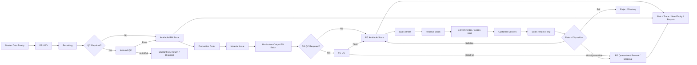

# 06_ERP_Process_Flow_ToBe_Phase1_My_Pham_v1

**Project:** ERP Web cho công ty sản xuất, phân phối và bán lẻ mỹ phẩm  
**Document Type:** Process Flow To-Be / Target Operating Flow  
**Scope:** Phase 1  
**Version:** v1.0  
**Date:** 2026-04-23  
**Language:** Vietnamese  
**Related Documents:**  
- ERP Blueprint v1  
- 03_ERP_PRD_SRS_Phase1_My_Pham_v1  
- 04_ERP_Permission_Approval_Matrix_Phase1_My_Pham_v1  
- 05_ERP_Data_Dictionary_Master_Data_Phase1_My_Pham_v1  

---

## 1. Mục tiêu tài liệu

Tài liệu này mô tả **luồng vận hành To-Be** sau khi ERP Phase 1 được triển khai cho 6 module lõi:

1. Dữ liệu gốc (Master Data)  
2. Mua hàng (Procurement)  
3. QA/QC  
4. Sản xuất (Production)  
5. Kho hàng (Warehouse / WMS cơ bản)  
6. Bán hàng (Sales / OMS cơ bản)  

Mục tiêu của tài liệu là để mọi bên cùng nhìn **một cách chạy thống nhất**:
- Business biết quy trình đích phải vận hành ra sao.
- BA biết phải đặc tả luồng và trạng thái thế nào.
- UI/UX biết phải thiết kế màn hình theo bước nào.
- Dev biết sự kiện nào kích hoạt sự kiện nào.
- Tester biết kiểm theo đường chạy nào.
- Key users biết bước nào là của bộ phận mình và bước nào phải bàn giao sang bộ phận khác.

Nói ngắn gọn:  
**PRD/SRS trả lời “hệ thống phải có gì”, còn Process Flow To-Be trả lời “doanh nghiệp sẽ chạy thế nào khi dùng hệ thống”.**

---

## 2. Phạm vi và ranh giới

### 2.1. In scope của tài liệu
Tài liệu này bao phủ:
- luồng chính end-to-end của Phase 1;
- các điểm bàn giao giữa bộ phận;
- các trạng thái trọng yếu;
- các điểm kiểm soát, phê duyệt và chặn rủi ro;
- các luồng ngoại lệ chính;
- các sự kiện hệ thống và cảnh báo tối thiểu.

### 2.2. Out of scope
Tài liệu này không đi sâu vào:
- HRM, payroll, CRM automation, KOL/Affiliate, POS nâng cao;
- hạch toán kế toán chi tiết theo chuẩn thuế;
- MRP nâng cao / AI forecast;
- tích hợp realtime với website/sàn/3PL;
- CAPA và complaint management nâng cao;
- routing sản xuất phức tạp nhiều công đoạn.

---

## 3. Nguyên tắc thiết kế luồng To-Be

1. **Một nguồn sự thật duy nhất**  
   Mọi giao dịch lõi phải sinh ra trong ERP hoặc được kiểm soát trong ERP. Không dùng Excel/chat như nguồn điều hành chính thức sau go-live.

2. **QC là cánh cổng chất lượng**  
   Hàng cần QC sẽ không được dùng cho sản xuất hoặc bán hàng trước khi có quyết định chất lượng hợp lệ.

3. **Kho quản lý hàng vật lý, QA quản lý trạng thái chất lượng**  
   Kho không tự ý cho hàng Fail/Hold thành Available. QA không tự ý thao tác xuất/nhập vật lý nếu không theo luồng kho.

4. **Không hard delete giao dịch lõi**  
   Chỉ được `Cancel`, `Close`, `Reverse`, hoặc tạo giao dịch điều chỉnh theo rule. Điều này giúp giữ dấu vết thật.

5. **Approval theo giá trị và rủi ro**  
   Giao dịch rủi ro cao hoặc vượt ngưỡng phải đi qua phê duyệt; giao dịch tác nghiệp tiêu chuẩn nên chạy nhanh, tránh làm hệ thống nặng nề.

6. **Batch / hạn dùng là mạch sống của ngành mỹ phẩm**  
   Các luồng nhập, xuất, sản xuất, QC, trả hàng đều phải bám theo batch/lô và hạn dùng khi item yêu cầu.

7. **Reserve và Available phải tách bạch**  
   Sales không được nhìn `physical stock` như hàng bán được. Hệ thống phải dùng `available stock` và `reserved stock` rõ ràng.

8. **Thao tác nghiệp vụ phải để lại audit log**  
   Đặc biệt với thay đổi trạng thái QC, stock adjustment, approval, override, thay đổi batch/expiry, giá/discount.

---

## 4. Vai trò tham gia trong các flow

| Vai trò | Ký hiệu | Trách nhiệm chính trong flow |
|---|---|---|
| Master Data Admin | MDA | Tạo/sửa dữ liệu gốc, chuẩn mã, cấu hình master |
| Requesting Department | RQ | Bộ phận phát sinh nhu cầu mua/sản xuất/bán |
| Purchasing Officer | POF | Tạo PR/PO, theo dõi NCC, tiếp nhận chứng từ mua |
| Purchasing Manager | PUM | Duyệt mua hàng theo ngưỡng, ngoại lệ NCC |
| Warehouse Staff | WST | Nhập/xuất/chuyển/kiểm kê hàng vật lý |
| Warehouse Manager | WMG | Duyệt điều chỉnh kho, giám sát tồn và thao tác vật lý |
| QC Officer | QCO | Thực hiện kiểm, nhập kết quả, tạo đề xuất QC |
| QA Manager | QAM | Duyệt Pass/Hold/Fail, release batch, quyết định chất lượng cuối |
| Production Planner | PPL | Tạo lệnh sản xuất, cân đối nhu cầu và kế hoạch |
| Production Supervisor | PSV | Điều hành lệnh, issue vật tư, xác nhận output và hao hụt |
| Sales Admin | SAD | Tạo quotation/SO/DO/sales return, theo dõi đơn |
| Sales Manager | SMG | Duyệt discount, ngoại lệ credit và chính sách bán |
| Finance Approver | FIN | Kiểm soát ngưỡng giá trị, công nợ, refund, write-off |
| Executive / COO / CEO | EXE | Duyệt vượt ngưỡng cao, ngoại lệ chiến lược |
| System | SYS | Tự động sinh mã, trạng thái, ledger, notification, validation |

---

## 5. Bản đồ end-to-end của Phase 1



### Ý nghĩa quản trị của bản đồ trên
- **Master Data Ready** là điều kiện mở màn. Dữ liệu gốc không sạch thì mọi flow phía sau đều sai.
- **Inbound QC** là cổng khóa đầu vào.
- **FG QC** là cổng khóa đầu ra của sản xuất.
- **Reserve** là chốt ngăn sales “bán đè lên nhau”.
- **Batch Trace** là chốt giúp truy xuất khi có lỗi, đổi trả, hoặc rủi ro thương hiệu.

---

## 6. Ma trận flow chính trong Phase 1

| Mã flow | Tên flow | Mục tiêu |
|---|---|---|
| F-01 | Master Data Create / Change / Activate | Chuẩn hóa dữ liệu gốc trước khi giao dịch chạy |
| F-02 | PR → PO → Receiving | Mua hàng và nhận hàng có kiểm soát |
| F-03 | Inbound QC → Release / Hold / Fail | Chặn đầu vào không đạt chất lượng |
| F-04 | Failed Inbound → Supplier Return / Disposal | Xử lý ngoại lệ hàng mua không đạt |
| F-05 | Production Order → Issue → Output | Chạy lệnh sản xuất có ghi nhận tiêu hao và batch |
| F-06 | FG QC → Release / Hold / Fail | Chặn thành phẩm chưa đạt khỏi bán hàng |
| F-07 | Warehouse Transfer / Count / Adjustment | Duy trì tính thật của tồn kho |
| F-08 | Quotation / SO → Reserve → Delivery | Kiểm soát đơn bán và giữ tồn |
| F-09 | Sales Return → Disposition | Xử lý hàng trả về không làm méo tồn kho |
| F-10 | Batch Trace / Near Expiry / Control Loop | Truy xuất và giám sát vận hành hàng ngày |

---

## 7. F-01 — Master Data Create / Change / Activate

### 7.1. Mục tiêu
Đảm bảo mọi giao dịch trong ERP chạy trên dữ liệu gốc chuẩn: item, BOM, supplier, customer, warehouse, price list, QC flags, batch/expiry rules.

### 7.2. Đầu vào
- Yêu cầu tạo mới / sửa / khóa dữ liệu gốc.
- Tài liệu nền: spec sản phẩm, BOM, thông tin NCC, thông tin khách hàng, cấu hình kho.

### 7.3. Đầu ra
- Master data ở trạng thái `Active`, `Inactive`, hoặc `Locked`.
- Lịch sử thay đổi (audit trail).
- Các rule nghiệp vụ sẵn sàng cho flow mua, kho, sản xuất, bán.

### 7.4. Điều kiện tiên quyết
- Mã chuẩn đã được thống nhất.
- Chủ sở hữu dữ liệu xác nhận thông tin đầu vào.
- Các trường bắt buộc theo Data Dictionary đã đầy đủ.

### 7.5. Luồng chính

| Bước | Vai trò | Hành động | Phản hồi hệ thống / kiểm soát | Đầu ra / trạng thái |
|---|---|---|---|---|
| 1 | RQ / owner dữ liệu | Gửi yêu cầu tạo/sửa master data | Ghi nhận request | Request opened |
| 2 | MDA | Tạo draft item/BOM/supplier/customer/warehouse/price list | Validate trùng mã, field bắt buộc, format | Draft |
| 3 | SYS | Kiểm tra rule dữ liệu | Chặn nếu trùng mã, thiếu UOM, thiếu flag batch/expiry, thiếu owner | Error hoặc pass |
| 4 | MDA | Submit for approval nếu master thuộc nhóm cần duyệt | Route theo matrix | Pending Approval |
| 5 | PUM / QAM / SMG / EXE (tùy loại dữ liệu) | Duyệt / từ chối | Audit log approval | Approved / Rejected |
| 6 | MDA | Activate master đã duyệt | Chỉ master active mới dùng trong giao dịch | Active |
| 7 | SYS | Khóa các trường trọng yếu sau giao dịch đầu tiên | Ví dụ item type, base UOM, batch flag, BOM active version | Locked fields |
| 8 | MDA | Inactivate nếu cần dừng dùng | Chỉ cho inactivate nếu không phá rule tồn/giao dịch mở | Inactive |

### 7.6. Luồng ngoại lệ
- **Trùng mã item/supplier/customer:** hệ thống chặn ngay ở bước draft.
- **Muốn sửa field trọng yếu sau khi đã có giao dịch:** không sửa trực tiếp; phải qua change request + audit + nếu cần tạo version mới.
- **Muốn inactivate item còn tồn kho hoặc còn open transaction:** hệ thống chặn hoặc buộc giải quyết tồn/giao dịch trước.

### 7.7. Điểm kiểm soát chính
- Không dùng master `Inactive` trên PR/PO/Production/SO.
- Chỉ 1 BOM version `Active` tại một thời điểm cho mỗi FG.
- Item có `batch_required = true` phải bắt batch ở mọi luồng receipt/issue.
- Item có `qc_required = true` sẽ tự kéo theo flow QC tương ứng.

### 7.8. KPI / SLA gợi ý
- Thời gian tạo master chuẩn: < 1 ngày làm việc với dữ liệu đầy đủ.
- Tỷ lệ master bị trả về do thiếu thông tin: theo dõi theo owner dữ liệu.
- Tỷ lệ item phát sinh giao dịch với dữ liệu sai rule: mục tiêu bằng 0.

---

## 8. F-02 — PR → PO → Receiving

### 8.1. Mục tiêu
Biến nhu cầu mua thành hàng nhận thực tế có kiểm soát, tạo nền cho inbound QC và tồn kho thật.

### 8.2. Đầu vào
- Nhu cầu từ sản xuất, kho, vận hành hoặc bộ phận liên quan.
- Master data đã sẵn sàng: item, supplier, warehouse.

### 8.3. Đầu ra
- PR, PO, Receiving record.
- Stock ledger inbound.
- Trigger cho inbound QC nếu item cần QC.

### 8.4. Luồng chính

```text
Nhu cầu mua → PR → PR Approval → PO → PO Approval → Receiving → QC Pending hoặc Available
```

| Bước | Vai trò | Hành động | Phản hồi hệ thống / kiểm soát | Đầu ra / trạng thái |
|---|---|---|---|---|
| 1 | RQ / POF | Tạo PR với item, qty, required date, lý do | Kiểm tra item active, UOM hợp lệ | PR Draft |
| 2 | POF | Submit PR | Route theo approval matrix | PR Pending Approval |
| 3 | PUM / EXE (nếu vượt ngưỡng) | Duyệt / từ chối PR | Audit log | PR Approved / Rejected |
| 4 | POF | Tạo PO từ PR approved hoặc direct PO nếu có quyền | Kiểm tra supplier active/approved | PO Draft |
| 5 | SYS | Tính subtotal, tax, total; kiểm ngưỡng | Nếu vượt ngưỡng thì yêu cầu approval | PO Pending Approval |
| 6 | PUM / FIN / EXE | Duyệt PO | Ghi log duyệt | PO Approved |
| 7 | WST | Nhận hàng vật lý đối chiếu với PO | Chỉ nhận từ PO approved; check tolerance | Receiving Draft |
| 8 | WST | Nhập qty nhận, batch, expiry, warehouse, location | Chặn nếu item cần batch/expiry mà thiếu | Receiving Confirmed |
| 9 | SYS | Cập nhật stock ledger inbound | Nếu `qc_required = true` thì stock vào `QC Pending/Quarantine`; nếu không thì vào `Available` | Stock updated |
| 10 | SYS | Cập nhật trạng thái PO | Partial hoặc full theo qty nhận | PO Partially Received / Fully Received |
| 11 | QCO / SYS | Nếu item cần QC, tự sinh phiếu inbound QC | Link receiving ↔ QC record | QC Draft / In Inspection |

### 8.5. Luồng ngoại lệ chính
1. **PR bị từ chối**  
   Quay về người tạo để chỉnh sửa hoặc hủy.
2. **PO vượt ngưỡng duyệt**  
   Route thêm FIN/EXE theo matrix.
3. **Nhận hàng vượt PO tolerance**  
   Hệ thống chặn hoặc yêu cầu override có quyền.
4. **NCC giao thiếu**  
   PO giữ ở `Partially Received`, phần còn lại mở.
5. **Sai batch/expiry/chứng từ**  
   Receiving không được confirm cho đến khi đủ dữ liệu.
6. **Muốn sửa PO sau khi đã receiving**  
   Không cho sửa dòng hàng, qty chính, supplier; chỉ cho phép field mô tả/đính kèm theo quyền.

### 8.6. Điểm bàn giao
- Purchasing bàn giao cho Warehouse tại thời điểm hàng vật lý và chứng từ đến kho.
- Warehouse bàn giao cho QC khi receiving đã confirm với item cần QC.
- QC bàn giao lại cho Warehouse/Production sau khi có quyết định `Pass`.

### 8.7. Điểm kiểm soát chính
- PO chưa `Approved` thì không được `Receiving`.
- Hàng có `QC Pending` không được coi là `Available`.
- Receiving phải gắn warehouse/location/batch/expiry theo rule.
- Stock ledger phải sinh ngay khi receiving confirm.

### 8.8. Trạng thái chuẩn liên quan
- **PR:** `Draft` → `Pending Approval` → `Approved` / `Rejected` / `Cancelled` / `Closed`
- **PO:** `Draft` → `Pending Approval` → `Approved` → `Partially Received` / `Fully Received` → `Closed` / `Cancelled`
- **Receiving:** `Draft` → `Confirmed` / `Cancelled`

---

## 9. F-03 — Inbound QC → Release / Hold / Fail

### 9.1. Mục tiêu
Đảm bảo nguyên liệu / bao bì / vật tư cần QC chỉ được dùng sau khi đạt chuẩn.

### 9.2. Trigger
- Receiving của item có `qc_required = true`.

### 9.3. Đầu ra
- Quyết định QC cuối: `Passed`, `On Hold`, hoặc `Failed`.
- Chuyển đổi stock status phù hợp.
- NCR cơ bản nếu có.

### 9.4. Luồng chính

```text
Receiving Confirmed → QC record auto-created → Inspection → QC proposal → QA approval → Pass/Hold/Fail
```

| Bước | Vai trò | Hành động | Phản hồi hệ thống / kiểm soát | Đầu ra / trạng thái |
|---|---|---|---|---|
| 1 | SYS | Tự sinh QC record từ receiving | Link supplier, item, batch, qty, receiving ref | QC Draft |
| 2 | QCO | Nhận mẫu/kiểm hàng và nhập kết quả | Cho phép đính kèm COA/ảnh/file | QC In Inspection |
| 3 | QCO | Đề xuất kết luận | Chọn Pass / Hold / Fail | QC Pending Approval |
| 4 | QAM | Duyệt quyết định QC | Chỉ vai trò đủ quyền được release cuối | QC Passed / On Hold / Failed |
| 5 | SYS | Chuyển stock status theo quyết định | Pass → `Available`; Hold/Fail → `Quarantine/Hold/Fail` | Stock status updated |
| 6 | SYS | Gửi thông báo cho Warehouse / Purchasing / Production nếu cần | Cảnh báo lô không dùng được | Notification sent |

### 9.5. Luồng ngoại lệ
- **Cần kiểm lại / hồ sơ chưa đủ:** giữ ở `On Hold`.
- **Muốn đổi từ Fail/Hold sang Pass:** chỉ qua quyền đặc biệt + lý do + audit log.
- **Thiếu chứng từ QC:** có thể cho `On Hold` chứ không được tự pass.

### 9.6. Điểm kiểm soát chính
- QC không được pass “miệng”; quyết định phải nằm trên record QC.
- Stock chỉ đổi status qua workflow QC, không sửa tay trong kho.
- QCO có thể nhập kết quả, nhưng `QAM` mới là người release cuối nếu cấu hình yêu cầu.

### 9.7. Trạng thái chuẩn liên quan
`Draft` → `In Inspection` → `Pending Approval` → `Passed` / `Failed` / `On Hold` / `Cancelled`

---

## 10. F-04 — Failed Inbound → Supplier Return / Disposal

### 10.1. Mục tiêu
Xử lý hàng mua không đạt mà không làm lệch tồn kho, không bỏ sót trách nhiệm NCC, không làm mờ batch trace.

### 10.2. Trigger
- Inbound QC kết luận `Failed` hoặc `On Hold` nhưng quyết định cuối là trả NCC / loại bỏ.

### 10.3. Luồng chính

| Bước | Vai trò | Hành động | Phản hồi hệ thống / kiểm soát | Đầu ra / trạng thái |
|---|---|---|---|---|
| 1 | QAM | Chốt disposition: return supplier / destroy / keep hold | Bắt buộc nhập lý do | Disposition selected |
| 2 | POF | Làm việc với NCC nếu trả hàng | Tạo Supplier Return reference | Return Draft |
| 3 | WST | Xuất trả theo batch fail | Chỉ cho phép xuất từ stock fail/quarantine liên quan | Return Confirmed |
| 4 | SYS | Giảm stock đúng batch/status | Cập nhật lịch sử receiving và NCC | Stock reduced |
| 5 | POF / FIN | Xử lý chứng từ tài chính ngoài Phase 1 ở mức tham chiếu | Lưu reference nếu có | Ref recorded |

### 10.4. Luồng ngoại lệ
- **Hàng fail nhưng chưa trả ngay:** giữ `Quarantine`.
- **Hàng chỉ fail một phần:** return theo qty batch fail, phần pass nếu có phải tách rõ.
- **Không trả NCC mà tiêu hủy:** tạo adjustment/disposal theo quyền phê duyệt.

### 10.5. Điểm kiểm soát chính
- Supplier return phải tham chiếu receiving và batch gốc.
- Không được chuyển hàng fail sang available bằng đường vòng.
- Mọi disposal phải có approval theo matrix.

---

## 11. F-05 — Production Order → Issue → Output

### 11.1. Mục tiêu
Biến nguyên liệu đạt chuẩn thành thành phẩm theo batch, ghi nhận planned vs actual, hao hụt, và truy xuất ngược được.

### 11.2. Trigger
- Kế hoạch sản xuất / nhu cầu bổ sung thành phẩm.

### 11.3. Đầu vào
- FG item active.
- BOM active.
- Nguyên liệu available đủ theo policy.
- Master kho và rule batch output.

### 11.4. Đầu ra
- Production Order.
- Material Issue ledger.
- FG batch output.
- Variance / scrap record.
- Trigger FG QC nếu cần.

### 11.5. Luồng chính

```text
Tạo PO sản xuất → Release → Reserve RM → Material Issue → Xác nhận sản xuất → FG Output Batch → FG QC Pending/Available
```

| Bước | Vai trò | Hành động | Phản hồi hệ thống / kiểm soát | Đầu ra / trạng thái |
|---|---|---|---|---|
| 1 | PPL | Tạo Production Order cho FG, qty planned, date | Load BOM active và planned requirement | Production Order Draft |
| 2 | PPL / PSV | Review requirement và release lệnh | Hệ thống kiểm BOM active, kiểm thiếu vật tư theo policy | Released |
| 3 | SYS / WST | Reserve nguyên liệu cho lệnh | Tách reserve khỏi available | Material Reserved |
| 4 | WST / PSV | Issue nguyên liệu theo batch thực tế | Chỉ issue từ batch available; không vượt available | In Progress + Stock issue ledger |
| 5 | PSV | Ghi actual consumption và tiến độ | Lưu variance so với planned | In Progress |
| 6 | PSV | Xác nhận output good qty, scrap/loss | Bắt buộc FG batch | Output recorded |
| 7 | SYS | Tạo stock inbound cho FG batch | Nếu FG cần QC thì vào `QC Pending`; nếu không thì `Available` | FG stock created |
| 8 | SYS | Khóa trace giữa FG batch và component batches | Lưu genealogy | Batch trace ready |
| 9 | PSV / PPL | Hoàn tất lệnh | Nếu output xong thì `Completed`; chờ QC ở batch output | Completed / QC Pending |
| 10 | PPL / PSV | Close lệnh khi đã xử lý xong mọi issue/output | Không close nếu còn reserve mở hoặc pending qty chưa xử lý theo policy | Closed |

### 11.6. Luồng ngoại lệ chính
1. **Thiếu vật tư nhưng vẫn muốn chạy lệnh**  
   Yêu cầu override theo quyền; hệ thống phải log thiếu gì và ai duyệt.
2. **Issue nhầm batch**  
   Không sửa tay stock; phải reverse / adjustment theo quyền.
3. **Thay đổi BOM khi lệnh đã release**  
   Không sửa BOM đang chạy; nếu thực sự thay đổi phải qua version/change control hoặc lệnh mới theo policy.
4. **Hủy lệnh trước khi issue**  
   Cho hủy và giải phóng reserve.
5. **Hủy lệnh sau khi đã issue / output**  
   Không hard delete; phải theo quy trình reversal / adjustment có phê duyệt.
6. **Output thiếu / thừa so với planned**  
   Cho phép nhưng phải lưu variance.

### 11.7. Điểm kiểm soát chính
- Chỉ BOM `Active` mới được dùng cho lệnh mới.
- Nguyên liệu `QC Pending` / `Hold` / `Fail` không được issue.
- Material issue và FG output đều phải sinh stock ledger.
- FG batch phải truy ngược về RM batches.

### 11.8. Trạng thái chuẩn liên quan
`Draft` → `Released` → `In Progress` → `Completed` → `Closed` / `Cancelled`  
Ghi chú: trạng thái QC có thể nằm ở output batch (`QC Pending`, `Passed`, `Hold`, `Fail`) thay vì chính Production Order.

---

## 12. F-06 — FG QC → Release / Hold / Fail

### 12.1. Mục tiêu
Đảm bảo thành phẩm chỉ được bán hoặc chuyển tiếp khi đã đạt QC.

### 12.2. Trigger
- FG output từ production cho item có `qc_required = true`.

### 12.3. Đầu ra
- FG batch được release thành `Available`, hoặc bị giữ/lỗi.

### 12.4. Luồng chính

| Bước | Vai trò | Hành động | Phản hồi hệ thống / kiểm soát | Đầu ra / trạng thái |
|---|---|---|---|---|
| 1 | SYS | Tạo FG QC record từ production output | Link production order, FG batch, qty | QC Draft |
| 2 | QCO | Kiểm mẫu thành phẩm, nhập kết quả | Đính kèm hồ sơ kiểm nếu có | In Inspection |
| 3 | QCO | Đề xuất Pass / Hold / Fail | Gửi duyệt | Pending Approval |
| 4 | QAM | Release quyết định cuối | Audit log | Passed / On Hold / Failed |
| 5 | SYS | Cập nhật stock status FG batch | Pass → Available; Hold/Fail → Quarantine/Hold/Fail | Stock updated |
| 6 | SYS | Mở khóa cho sales reservation nếu batch pass | Batch mới có thể allocate | Available for sales |

### 12.5. Luồng ngoại lệ
- **FG Hold:** chưa cho reserve, chưa cho xuất bán.
- **FG Fail:** giữ ở fail/quarantine; xử lý rework/disposal ở phase sau hoặc theo adjustment được duyệt.
- **Pass một phần batch:** nếu nghiệp vụ cho phép phải tách batch/qty rõ ràng; nếu chưa hỗ trợ thì không dùng partial pass ở Phase 1.

### 12.6. Điểm kiểm soát chính
- Sales không thấy batch FG chưa pass như stock bán được.
- Warehouse không tự đổi FG từ Hold sang Available.
- Mọi chuyển trạng thái QC cuối phải có người chịu trách nhiệm.

---

## 13. F-07 — Warehouse Transfer / Count / Adjustment

### 13.1. Mục tiêu
Giữ tồn kho thật, rõ, và có dấu vết khi hàng di chuyển hoặc phát sinh chênh lệch.

### 13.2. Phạm vi
- Transfer giữa kho / location.
- Cycle count / stock count.
- Stock adjustment.
- Near-expiry monitoring.
- View stock theo batch/status.

### 13.3. F-07A — Transfer giữa kho / location

| Bước | Vai trò | Hành động | Phản hồi hệ thống / kiểm soát | Đầu ra / trạng thái |
|---|---|---|---|---|
| 1 | WST | Tạo transfer request | Chọn source, destination, item, batch, qty | Transfer Draft |
| 2 | WMG | Duyệt nếu cần | Theo matrix/ngưỡng | Approved |
| 3 | WST | Xác nhận xuất từ kho nguồn | Chỉ lấy từ available/status hợp lệ | In Transit / Issued |
| 4 | WST | Xác nhận nhập kho đích | Giữ nguyên batch/expiry/status theo rule | Transfer Completed |
| 5 | SYS | Tạo ledger 2 đầu | Giảm source, tăng destination | Stock updated |

**Điểm kiểm soát:**  
- Không được chuyển hàng fail thành available bằng transfer.  
- Nếu dùng trạng thái `In Transit`, phải có bước receipt ở kho đích.  

### 13.4. F-07B — Stock Count / Cycle Count

| Bước | Vai trò | Hành động | Phản hồi hệ thống / kiểm soát | Đầu ra / trạng thái |
|---|---|---|---|---|
| 1 | WMG | Tạo đợt kiểm kê | Chọn kho, location, phạm vi item/batch | Count Plan |
| 2 | WST | Kiểm đếm thực tế | Có thể khóa giao dịch tạm thời theo policy | Count Lines |
| 3 | SYS | So sánh system vs physical | Tính chênh lệch | Variance detected |
| 4 | WMG / FIN / EXE | Duyệt chênh lệch nếu vượt ngưỡng | Log lý do | Approved variance |
| 5 | WST / SYS | Tạo stock adjustment | Không sửa tay tồn trực tiếp | Adjustment posted |

**Điểm kiểm soát:**  
- Kiểm kê phải ra **adjustment transaction**, không phải update số tay.  
- Chênh lệch lớn cần approval theo matrix.  

### 13.5. F-07C — Near Expiry Monitoring

| Bước | Vai trò | Hành động | Phản hồi hệ thống / kiểm soát | Đầu ra |
|---|---|---|---|---|
| 1 | SYS | Chạy rule cảnh báo cận date theo ngưỡng | Tính theo expiry_date và số ngày còn lại | Near-expiry list |
| 2 | WMG / PPL / SAD | Xem danh sách cận date | Ưu tiên xuất FEFO, đẩy bán, hoặc lên kế hoạch xử lý | Action queue |
| 3 | EXE / Ops | Quyết định chiến thuật xử lý | Discount, chuyển kênh, hold, disposal | Decision |

### 13.6. Điểm kiểm soát chung của F-07
- Mọi biến động đều phải sinh stock ledger.
- Stock status tách rõ: `Available`, `Reserved`, `QC Pending`, `On Hold`, `Fail`, `Quarantine`, `In Transit`.
- Tồn khả dụng không được tính từ tổng tồn vật lý.

---

## 14. F-08 — Quotation / SO → Reserve → Delivery

### 14.1. Mục tiêu
Kiểm soát đơn bán từ lúc tạo đến lúc xuất giao, tránh bán âm, tránh phá giá, và giữ rõ batch xuất.

### 14.2. Đầu vào
- Customer active.
- Price list active.
- Stock available.
- Policy credit/discount.

### 14.3. Đầu ra
- Quotation (nếu dùng), Sales Order, Delivery Order.
- Reserve stock.
- Goods issue outbound.
- Tình trạng đơn hàng rõ ràng.

### 14.4. Luồng chính

```text
Quotation (optional) → Sales Order → Approval if needed → Reserve Stock → Delivery Order → Goods Issue → Shipped / Delivered / Closed
```

| Bước | Vai trò | Hành động | Phản hồi hệ thống / kiểm soát | Đầu ra / trạng thái |
|---|---|---|---|---|
| 1 | SAD | Tạo quotation hoặc SO trực tiếp | Load customer, channel, warehouse | Quote Draft / SO Draft |
| 2 | SYS | Gợi ý giá theo price list | Tính subtotal, discount, tax, total | Price loaded |
| 3 | SAD | Chỉnh discount trong quyền cho phép nếu cần | Nếu vượt ngưỡng hoặc dính credit rule thì route approval | SO Pending Approval hoặc Confirmed |
| 4 | SMG / FIN / EXE | Duyệt SO ngoại lệ | Ghi log duyệt | SO Confirmed |
| 5 | SYS | Reserve stock từ available | Có thể gợi ý batch theo FEFO | SO Reserved |
| 6 | SAD / WST | Tạo Delivery Order từ SO confirmed/reserved | Hệ thống hiển thị qty còn giao | DO Draft |
| 7 | WST | Chọn batch xuất và confirm issue | Chỉ cho lấy từ batch available | DO Confirmed / Shipped |
| 8 | SYS | Tạo outbound stock ledger | Giảm available/reserved đúng batch | Stock updated |
| 9 | SAD | Xác nhận delivered/close khi hoàn tất | Theo policy chứng từ giao hàng | Delivered / Closed |

### 14.5. Luồng ngoại lệ chính
1. **Discount vượt ngưỡng**  
   Route cho SMG/FIN/EXE.
2. **Khách chạm hoặc vượt credit limit tham chiếu**  
   Cảnh báo hoặc chặn theo cấu hình.
3. **Không đủ available stock**  
   Không cho reserve hoặc delivery nếu không có quyền override.
4. **Partial delivery**  
   Hệ thống cho phép giao nhiều lần; SO ở `Partially Delivered`.
5. **Muốn đổi batch đã reserve**  
   Chỉ đổi nếu batch mới vẫn available và chưa issue.
6. **Khách hủy trước khi giao**  
   Hủy SO/DO và giải phóng reserve.
7. **Đã giao rồi mới phát hiện lỗi**  
   Đi qua flow Sales Return hoặc batch control xử lý, không sửa tay đơn cũ.

### 14.6. Điểm kiểm soát chính
- SO chưa approved thì không reserve.
- Reserve chỉ lấy từ `Available`.
- Delivery chỉ issue từ batch `Available`.
- Item `batch_required = true` phải xác định batch trên DO/Goods Issue.
- Batch FG đang `Hold` / `Fail` không thể allocate.

### 14.7. Trạng thái chuẩn liên quan
- **Quotation:** `Draft` → `Sent` → `Approved` (nếu dùng) / `Expired` / `Converted` / `Cancelled`
- **SO:** `Draft` → `Pending Approval` → `Confirmed` → `Reserved` → `Partially Delivered` / `Delivered` → `Closed` / `Cancelled`
- **DO:** `Draft` → `Confirmed` → `Shipped` → `Delivered` / `Cancelled`

---

## 15. F-09 — Sales Return → Disposition

### 15.1. Mục tiêu
Nhận và xử lý hàng trả về theo đúng batch/tình trạng thực tế, không làm nhập lại nhầm hàng lỗi thành hàng bán được.

### 15.2. Trigger
- Khách trả hàng sau giao.
- Hàng lỗi, giao sai, hàng không đạt yêu cầu.

### 15.3. Đầu ra
- Sales Return record.
- Stock return theo disposition.
- Audit về batch trả về và tình trạng hàng.

### 15.4. Luồng chính

| Bước | Vai trò | Hành động | Phản hồi hệ thống / kiểm soát | Đầu ra / trạng thái |
|---|---|---|---|---|
| 1 | SAD | Tạo sales return tham chiếu SO/DO | Chọn item, qty, lý do | Return Draft |
| 2 | SMG / FIN (nếu cần) | Duyệt return theo policy | Log approval | Pending Approval / Approved |
| 3 | WST | Nhận hàng trả vật lý | Chọn batch trả về hoặc xác định lại theo policy | Return Received |
| 4 | WST / QCO | Chọn disposition của hàng trả | `Available` / `Quarantine` / `Fail` | Disposition selected |
| 5 | SYS | Tạo inbound stock ledger phù hợp | Không mặc định trả về available nếu chưa đủ điều kiện | Stock updated |
| 6 | SAD / FIN | Đóng return, xử lý chứng từ liên quan ngoài Phase 1 ở mức tham chiếu | Lưu ref | Closed |

### 15.5. Quy tắc disposition khuyến nghị
- **Available:** chỉ khi hàng còn sellable theo policy, còn nguyên, đúng batch, không có dấu hiệu ảnh hưởng chất lượng.
- **Quarantine / Hold:** khi cần kiểm thêm hoặc chưa chắc sellable.
- **Fail:** khi hàng không đạt, hư hỏng, nghi nhiễm bẩn, sai tiêu chuẩn.

### 15.6. Luồng ngoại lệ
- **Khách không cung cấp được batch:** vẫn phải nhận theo policy nhưng đánh dấu cần kiểm tra; tuyệt đối không nhập thẳng available nếu mặt hàng có yêu cầu batch chặt.
- **Trả hàng một phần:** hệ thống cho phép theo qty thực tế.
- **Đơn đã close:** vẫn có thể mở flow return theo chính sách hậu mãi, không sửa lùi đơn gốc.

### 15.7. Điểm kiểm soát chính
- Return phải trace được tới SO/DO gốc nếu có.
- Không nhập lại hàng trả về thành available theo mặc định.
- Return disposition là điểm rủi ro lớn, nên cần role/phê duyệt phù hợp.

### 15.8. Trạng thái chuẩn liên quan
`Draft` → `Pending Approval` → `Received` → `Closed` / `Cancelled`

---

## 16. F-10 — Batch Trace / Near Expiry / Daily Control Loop

### 16.1. Mục tiêu
Tạo khả năng điều hành hằng ngày và khả năng truy xuất khi có sự cố chất lượng hoặc kinh doanh.

### 16.2. F-10A — Batch Trace

#### Hướng truy xuất 1: FG batch → RM batches
Mục đích:
- biết thành phẩm batch nào dùng nguyên liệu batch nào;
- hỗ trợ xử lý complaint / hold / recall nội bộ.

**Luồng sử dụng:**
1. Chọn FG batch.
2. Hệ thống hiển thị production order liên quan.
3. Hệ thống hiển thị các component batch đã issue.
4. Hệ thống hiển thị receiving / supplier của component batches.
5. Hệ thống hiển thị sales deliveries đã xuất FG batch đó (nếu tracking tới mức cần thiết trong Phase 1).

#### Hướng truy xuất 2: RM inbound batch → các FG / giao dịch đã dùng
Mục đích:
- khi nguyên liệu đầu vào có vấn đề, biết ảnh hưởng lan đến đâu.

**Luồng sử dụng:**
1. Chọn inbound batch.
2. Hệ thống liệt kê các production orders đã issue batch này.
3. Hệ thống liệt kê FG batches đầu ra liên quan.
4. Hệ thống liệt kê SO/DO đã xuất từ FG batches đó nếu có.

### 16.3. F-10B — Daily Control Loop cho vận hành

| Nhóm người dùng | Việc cần kiểm mỗi ngày | Nguồn trong ERP |
|---|---|---|
| Purchasing | PR pending, PO pending approval, PO overdue receiving | PR/PO dashboard |
| Warehouse | Pending receiving, pending transfer, stock count variance, near-expiry | Warehouse dashboard |
| QA/QC | Inbound QC pending, FG QC pending, batch hold/fail | QC dashboard |
| Production | Lệnh released chưa issue, lệnh in progress, variance, scrap | Production dashboard |
| Sales | SO pending approval, SO chưa reserve, đơn pending delivery, return pending | Sales dashboard |
| COO/CEO | Batch hold, tồn cận date, vật tư thiếu, đơn tắc giao, ngoại lệ approval | Executive dashboard |

### 16.4. F-10C — Near Expiry Control
Hệ thống chạy danh sách cận date theo ngưỡng cấu hình (ví dụ 30/60/90 ngày), để:
- ưu tiên FEFO khi giao;
- kích hoạt kế hoạch bán/đẩy kênh;
- chuyển sample/tester nếu còn hợp lệ theo chính sách;
- đưa ra quyết định hold hoặc tiêu hủy.

---

## 17. Event Matrix — sự kiện hệ thống và thông báo tối thiểu

| Sự kiện | Người nhận tối thiểu | Hành động kỳ vọng |
|---|---|---|
| PR submitted | PUM | Review & approve/reject |
| PO submitted | PUM / FIN / EXE theo ngưỡng | Duyệt mua hàng |
| Receiving confirmed cho item cần QC | QCO, QAM | Tiến hành inbound QC |
| Inbound QC Failed / Hold | POF, WMG, PPL | Chặn dùng hàng, xử lý NCC/kế hoạch |
| Production Order released | WST, PSV | Chuẩn bị cấp phát |
| Material shortage detected | PPL, POF, COO | Mua bù / reschedule |
| FG QC Passed | WMG, SAD | Mở available cho bán / phân bổ |
| FG QC Failed / Hold | COO, WMG, SAD | Chặn reserve / xử lý batch |
| SO pending approval | SMG / FIN / EXE | Duyệt giá / credit |
| SO reserved but overdue delivery | SAD, WMG | Điều phối giao hàng |
| Stock variance vượt ngưỡng | WMG, FIN, EXE | Điều tra và duyệt adjustment |
| Near-expiry alert | WMG, SAD, COO | Kích hoạt phương án xử lý |

---

## 18. Quy tắc bàn giao giữa các bộ phận

### 18.1. Purchasing → Warehouse
Bàn giao hoàn tất khi:
- PO đã approved;
- hàng vật lý đã đến;
- chứng từ tối thiểu đã có;
- Warehouse có thể thực hiện receiving.

### 18.2. Warehouse → QC
Bàn giao hoàn tất khi:
- receiving đã confirm;
- batch/expiry/qty/warehouse/location đã nhập đủ;
- QC record đã được tạo.

### 18.3. QC → Production / Warehouse / Sales
Bàn giao hoàn tất khi:
- quyết định cuối đã được release;
- stock status đã đổi đúng;
- các bộ phận liên quan nhận được notification.

### 18.4. Planning → Production
Bàn giao hoàn tất khi:
- Production Order đã released;
- requirement rõ;
- policy về thiếu vật tư được xác định.

### 18.5. Sales → Warehouse
Bàn giao hoàn tất khi:
- SO đã confirmed/approved;
- reserve đã thành công;
- DO hoặc yêu cầu giao đã tạo rõ.

### 18.6. Warehouse → Sales / Customer
Bàn giao hoàn tất khi:
- hàng đã issue đúng batch;
- DO/goods issue đã confirm;
- trạng thái shipment được cập nhật theo phạm vi Phase 1.

---

## 19. Global Exception Rules — quy tắc ngoại lệ toàn cục

1. **Không có bước nào được “đi tắt” mà không có dấu vết.**
2. **Override chỉ dành cho role được cấp quyền và luôn phải nhập lý do.**
3. **Không được sửa tay tồn kho hoặc QC status ngoài luồng chuẩn.**
4. **Mọi thay đổi sau khi giao dịch đã ảnh hưởng tới hàng phải dùng reverse/adjustment.**
5. **Các giao dịch mở liên quan tới item/batch bị Hold/Fail phải được dashboard cảnh báo.**
6. **Khi nghi ngờ dữ liệu sai, ưu tiên khóa luồng hơn là cho chạy tiếp.**  
   Một ngày chậm còn rẻ hơn một batch lỗi ra thị trường.

---

## 20. SLA / KPI vận hành gợi ý theo flow

| Flow | KPI / SLA gợi ý | Ý nghĩa điều hành |
|---|---|---|
| F-01 Master Data | Thời gian activate master mới | Tốc độ mở hàng/mở NCC/mở khách |
| F-02 Procurement | PR approval lead time, PO approval lead time, receiving OTIF | Chất lượng mua hàng và phản ứng vận hành |
| F-03 Inbound QC | TAT QC inbound, tỷ lệ pass/fail theo NCC | Sức khỏe đầu vào và chất lượng NCC |
| F-05 Production | Lệnh hoàn thành đúng kế hoạch, variance material, scrap rate | Hiệu suất sản xuất |
| F-06 FG QC | TAT FG QC, tỷ lệ batch hold/fail | Chất lượng thành phẩm |
| F-07 Warehouse | Tỷ lệ chênh lệch kiểm kê, near-expiry value, reserve accuracy | Độ thật của kho |
| F-08 Sales | SO approval lead time, fill rate, OTIF delivery | Chất lượng đáp ứng đơn hàng |
| F-09 Sales Return | Return rate, tỷ lệ return về available vs quarantine/fail | Chất lượng giao hàng/sản phẩm |
| F-10 Traceability | Thời gian truy xuất batch | Khả năng phản ứng khi có sự cố |

---

## 21. Checklist xác nhận trước khi build / trước UAT

### 21.1. Checklist nghiệp vụ
- [ ] Đã chốt owner cho từng nhóm master data.
- [ ] Đã chốt ngưỡng approval cho PR, PO, stock adjustment, SO, sales return.
- [ ] Đã chốt rule item nào cần batch, expiry, QC.
- [ ] Đã chốt rule FG batch naming.
- [ ] Đã chốt policy reserve stock.
- [ ] Đã chốt rule return disposition.
- [ ] Đã chốt near-expiry thresholds.

### 21.2. Checklist dữ liệu
- [ ] Có danh sách item master chuẩn.
- [ ] Có supplier master và approved supplier list tối thiểu.
- [ ] Có customer master và nhóm price list.
- [ ] Có warehouse/location master.
- [ ] Có BOM active cho FG trong scope Phase 1.

### 21.3. Checklist hệ thống
- [ ] Role & permission đã map theo matrix.
- [ ] Approval workflow đã cấu hình.
- [ ] Numbering rule đã chốt.
- [ ] Audit log bật cho field trọng yếu.
- [ ] Dashboard cảnh báo cơ bản đã xác định.

---

## 22. Những quyết định nên khóa sớm để tránh đổi qua đổi lại

1. Có cho direct PO không, và role nào được dùng.
2. Tolerance receiving so với PO là bao nhiêu.
3. Có bắt partial QC/pass một phần batch trong Phase 1 hay không.
4. Có dùng trạng thái `In Transit` cho transfer hay chỉ transfer một bước.
5. Sales reserve theo SO ngay khi confirm hay chỉ reserve khi tạo DO.
6. Credit limit dùng ở mức cảnh báo hay chặn cứng.
7. Return hàng về available phải thỏa các điều kiện nào.
8. Có tách kho/sample/tester ngay Phase 1 hay quản qua stock status.
9. Truy xuất outbound batch ở mức nào trong Phase 1.
10. Khi FG QC fail, có quy trình rework ngay hay chỉ hold/fail/disposal.

---

## 23. Kết luận

Flow To-Be của Phase 1 được xây theo một logic rất rõ:

**Master data chuẩn → Mua đúng → QC chặn đầu vào → Sản xuất có dấu vết → QC chặn đầu ra → Kho thật → Bán không vượt tồn → Trả hàng có kiểm soát → Truy xuất được mọi thứ quan trọng.**

Nếu đội triển khai giữ đúng logic này, công ty sẽ có được 3 thứ cực đáng tiền ngay từ Phase 1:
1. **Không mù hàng** — biết chính xác cái gì đang ở đâu, batch nào, trạng thái gì.  
2. **Không mù chất lượng** — hàng chưa đạt không lọt vào sản xuất hoặc bán.  
3. **Không mù dòng chảy vận hành** — biết khâu nào đang nghẽn, ai đang giữ bóng, ai phải xử lý tiếp.  

---

## 24. Tài liệu nên làm tiếp sau tài liệu này

Thứ tự hợp lý tiếp theo là:

1. **07_ERP_Report_KPI_Catalog_Phase1_My_Pham_v1.md**  
   Chốt CEO, COO, Purchasing, QA, Kho, Sản xuất, Sales sẽ nhìn báo cáo gì.

2. **08_ERP_Screen_List_Wireframe_Phase1_My_Pham_v1.md**  
   Chốt danh sách màn hình, form, list, action, button, filter.

3. **09_ERP_UAT_Test_Scenarios_Phase1_My_Pham_v1.md**  
   Chốt case test nghiệm thu theo từng flow ở trên.
